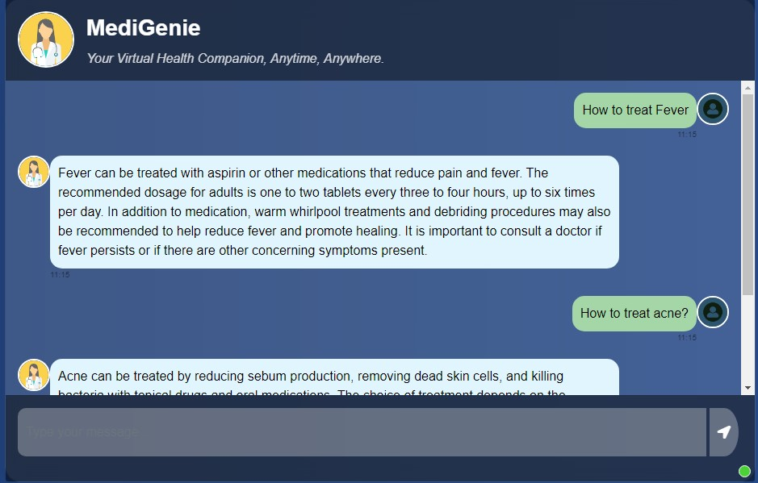

# MediGenie - RAG-based Chatbot Application

## Overview
**MediGenie** is a **Retrieval-Augmented Generation (RAG)-based chatbot** designed to assist users with health-related inquiries. It provides **reliable and concise responses** by retrieving relevant context from indexed medical documents. The chatbot leverages modern **NLP models** to deliver intelligent responses and ensure user queries are addressed accurately.

---

## Features

- **Interactive Chat Interface**  
  Users can ask questions related to medical conditions and receive concise answers.

- **RAG Architecture**  
  Combines **document retrieval with generation** for accurate and context-aware responses.

- **Embeddings with Pinecone**  
  Uses the **Pinecone vector database** to store embeddings for fast retrieval.

- **Frosted Glass UI Design**  
  Modern user interface with a **clean and elegant layout**.

- **Hosted on Flask**  
  A lightweight **Flask web server** handles chat interactions.

---

# How It Works

## 1. Document Embeddings with Pinecone

### **Step 1: Processing Documents with Sentence-Transformers**

- The **Sentence-Transformers library** is used to convert text documents into **vector embeddings**.  
- These embeddings are **mathematical representations** of the content, where each document or chunk is represented by a **high-dimensional vector**.
- Sentence-Transformers models like **all-MiniLM-L6-v2** create embeddings that capture the **semantic meaning** of the text, allowing the chatbot to **understand the similarity** between questions and documents.

#### **Example:**
- **"How to treat fever?"** will have a unique vector representation that captures its meaning.  
- A **medical document** discussing fever treatments will have a **similar vector**, helping the chatbot identify it as relevant.

---

### **Step 2: Storing Embeddings in Pinecone Database**

- These embeddings are stored in a **vector database**, specifically **Pinecone**.  
- Pinecone provides **fast vector search capabilities**, meaning it can quickly find documents or chunks with vectors similar to the user's query.  
- When new documents are added to the application, their embeddings are **indexed in Pinecone** for future retrieval.

#### **Why Pinecone?**
- **Low-latency vector search** ensures that relevant documents are retrieved within **milliseconds**.  
- The vector database grows **efficiently**, allowing you to **add as many medical documents** as needed over time.

---

## 2. Retrieval-Augmented Generation (RAG) Pipeline

### **Step 1: User Query and Document Retrieval**

- When a **user asks a question** (e.g., "How to treat acne?"), the chatbot **converts the question into an embedding vector** using the same Sentence-Transformers model.  
- The vectorized query is sent to **Pinecone**, which retrieves the **most relevant documents or chunks** from the stored embeddings.  
- The retrieved documents contain the most **similar content** related to the user's query.

#### **Example:**
- For the query **"How to treat acne?"**, the system might retrieve a document that discusses **topical treatments and oral medications** for acne.

---

### **Step 2: Generating the Response Using LangChain and LLM**

- After retrieving relevant documents, the chatbot uses the **LangChain framework** to pass these documents as **context to the LLM** (Large Language Model).  
- A **predefined prompt template** (e.g., "Use the following documents to answer the question...") ensures that the **LLM generates a concise, context-aware response**.  
- The **LLM summarizes** the content from the retrieved documents and provides an **answer to the user**.

#### **Example Workflow:**
1. **User:** "How to treat fever?"  
2. **Pinecone** retrieves a document on fever treatments.  
3. **LangChain** prompts the LLM to generate a concise answer using the retrieved document.  
4. **Chatbot Response:**  
   _"Fever can be treated with aspirin or medications that reduce pain and fever. It's important to consult a doctor if symptoms persist."_

---

## 3. Chat Interface

### **Step 1: User Interaction via Flask Web Interface**

- The chatbot interface is built using **HTML, CSS, and Flask**. Flask serves as the backend to **handle user interactions**.  
- When a user types a query, the input is sent to the **Flask backend**, which processes the query through the **RAG pipeline**.

#### **How AJAX Works in the Chatbot:**
1. When the user submits a query, an **AJAX request** is sent to the `/get` endpoint.  
2. The Flask backend processes the query using the **RAG pipeline** and sends the **response back to the frontend**, where it is displayed.

---

### **Step 2: Styling the Conversation with Modern UI**

- The conversation UI is designed using **Bootstrap and custom CSS** with a **frosted-glass effect** for a sleek and modern look.  
- **User messages** are displayed in green bubbles, while **chatbot responses** are shown in blue bubbles.  
- **Avatars** for the user and chatbot are aligned properly, with **timestamps** below each message.

#### **Features of the UI:**
- **Message Input Field:** Users can type their queries in a neat message box.  
- **Send Button:** A clickable button with a **paper-plane icon** sends the message.  
- **User and Chatbot Avatars:** Each message is accompanied by an avatar (user or chatbot) for clarity.  
- **Responsive Design:** The UI adjusts gracefully for **mobile screens and smaller devices**.

---

### **End-to-End Flow of a Query:**

1. **User Input:** The user asks, "How to treat fever?"  
2. **Embedding Generation:** The query is transformed into an embedding using Sentence-Transformers.  
3. **Pinecone Retrieval:** Pinecone returns the most relevant documents related to "fever treatments."  
4. **LLM Response Generation:** LangChain sends the retrieved documents to the LLM, which generates a concise answer.  
5. **Response Display:** The answer is sent to the **frontend** and displayed to the user in the **chat interface**.

---

## Why Use Retrieval-Augmented Generation (RAG)?

- **Combines Retrieval and Generation:** RAG ensures the chatbot doesn’t just generate **generic responses** but uses **relevant context** from the indexed documents.  
- **Scalable and Up-to-date:** New medical content can be added anytime by **updating the Pinecone vector store**, keeping the chatbot’s knowledge current.  
- **Accurate Answers:** Grounding responses on real documents helps the chatbot **avoid hallucination** and generate **reliable medical advice**.

## Usage

### **Start the Application**  
Run the following command to start the Flask app:

python app.py

### **Access the Chatbot**
Open your browser and visit:

http://127.0.0.1:8080

### **Example**

User: How to treat fever?
MediGenie: Fever can be treated with aspirin or other medications that reduce pain and fever. The recommended dosage for adults is one to two tablets every three to four hours, up to six times per day. In addition to medication, warm whirlpool treatments and debriding procedures may also be recommended to help reduce fever and promote healing. It is important to consult a doctor if fever persists or if there are other concerning symptoms present.

## Future Improvements

- **Add Authentication:**  
  Secure the chatbot with **login functionality** to ensure only authorized users can access it.

- **Deploy to Cloud:**  
  Host the app on **AWS** or **GCP** to provide **wider access** and scalability.

- **Add Voice Interaction:**  
  Integrate **speech-to-text** functionality for a more interactive user experience.

- **Implement RAG Fusion:**  
  Explore **RAG fusion techniques** to combine multiple retrieved documents or sources more effectively. This will enhance the chatbot's ability to provide **comprehensive and context-aware responses** by fusing information from **multiple relevant documents**.
